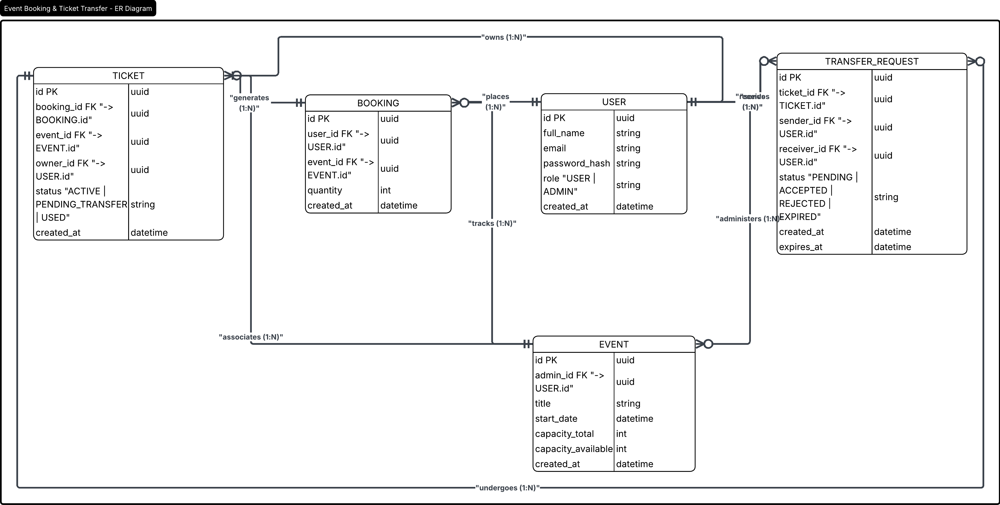
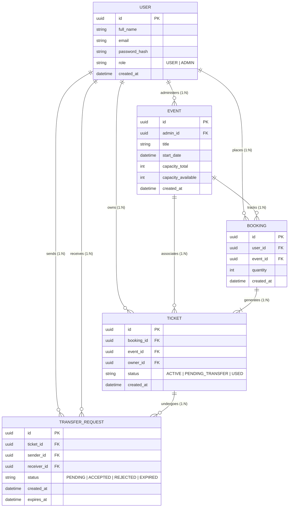

# Relational Entity Diagram

This strictly outlines the normalized design of the PostgreSQL schema tables representing the underlying data engine. 

The granular `TICKET` row allows for single-item transfers, rather than awkwardly transferring batch-level `BOOKING` rows.

