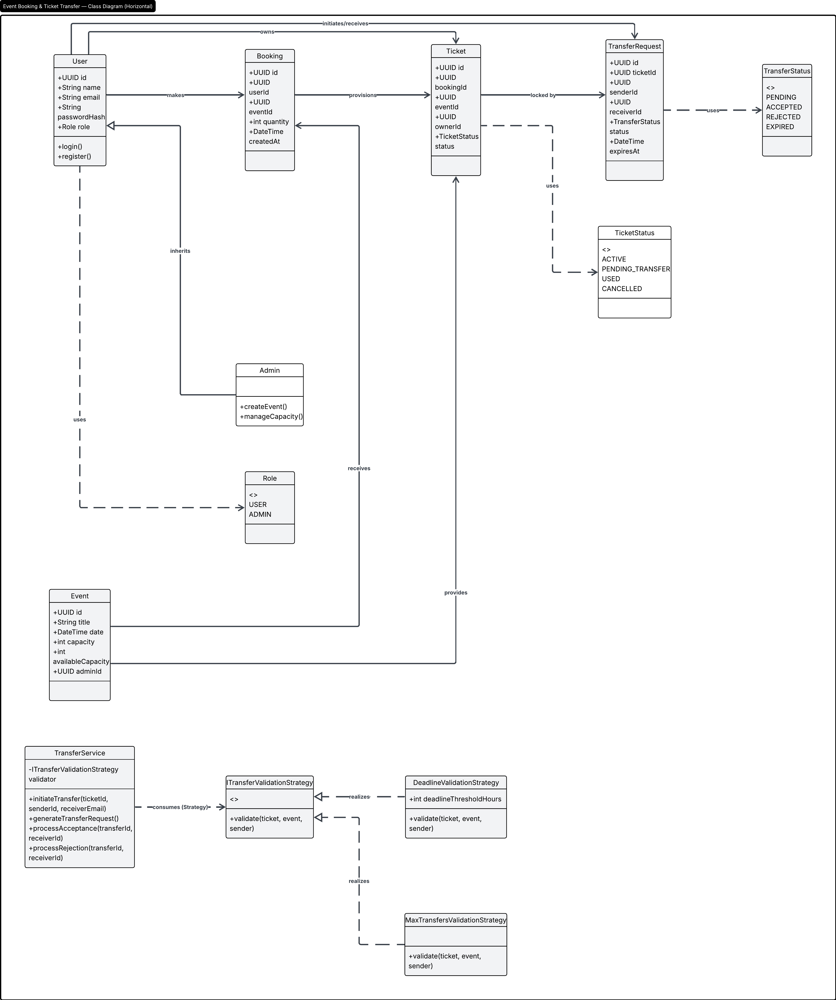
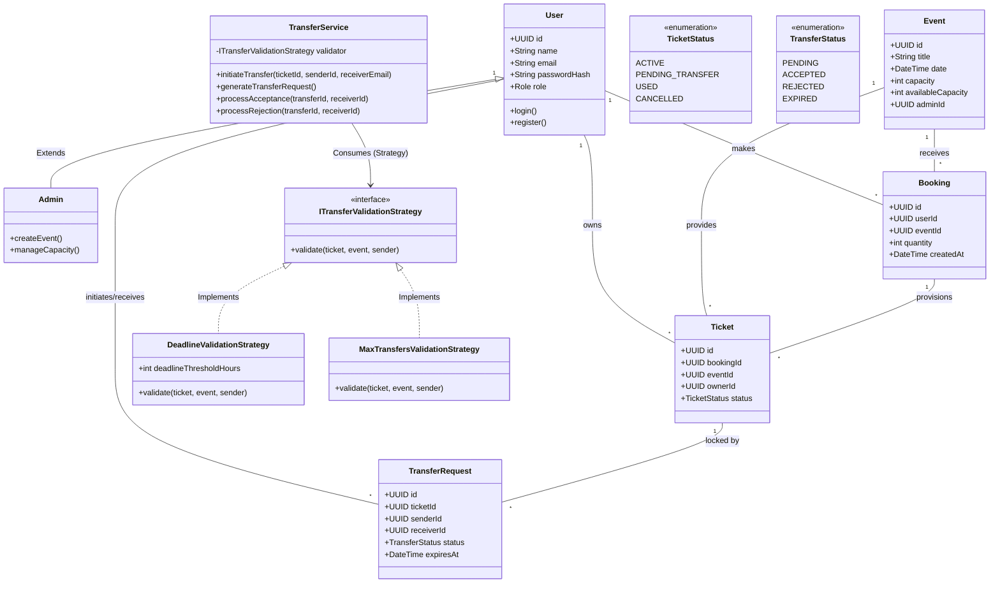

# OOP Domain Data Models & Hierarchy

This diagram showcases the application of standard Object-Oriented principles in the domain models (Inheritance, Enums) alongside architectural implementations of common patterns like the **Strategy Pattern**.

