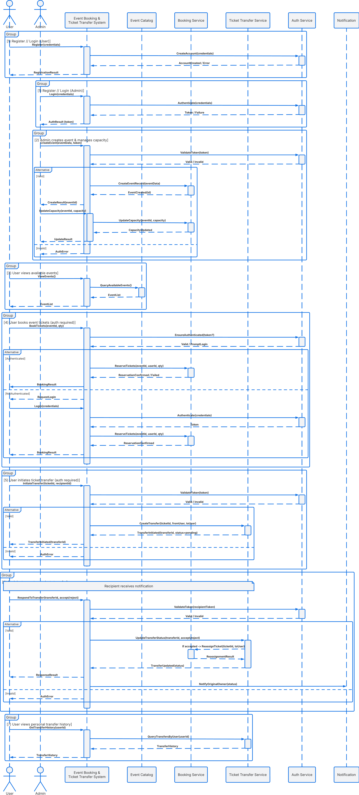
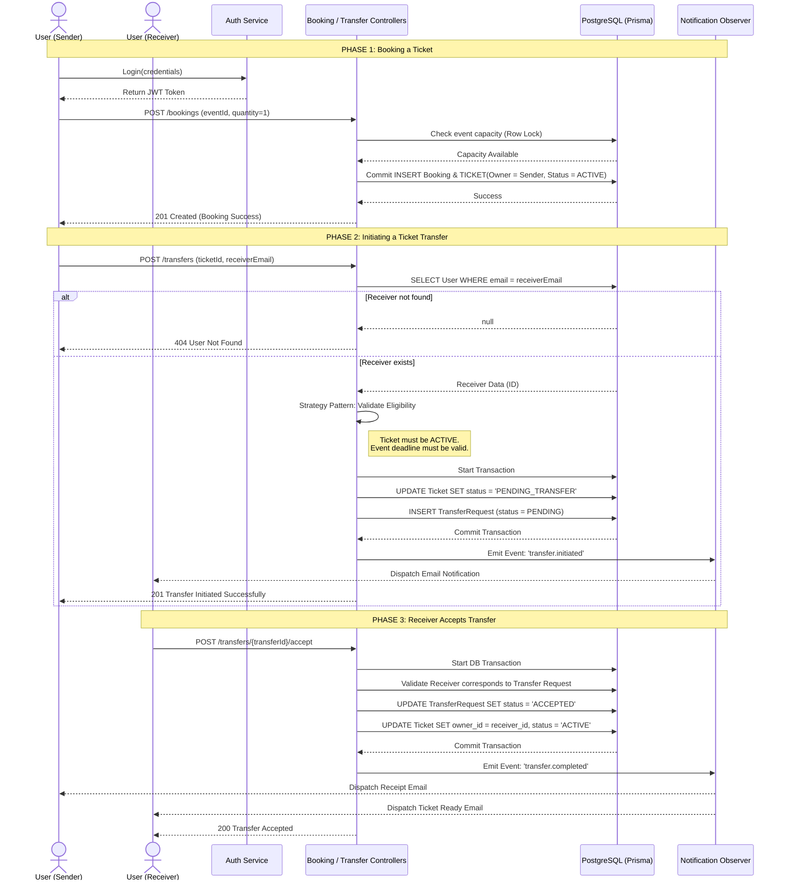

# End-to-End Sequence Flow

This sequence highlights the flow of user bookings into the granular ticket transfer engine. Crucially, it demonstrates how the database transaction state and the observer-driven notifications are handled by the backend.

