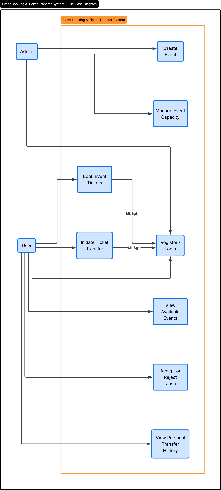
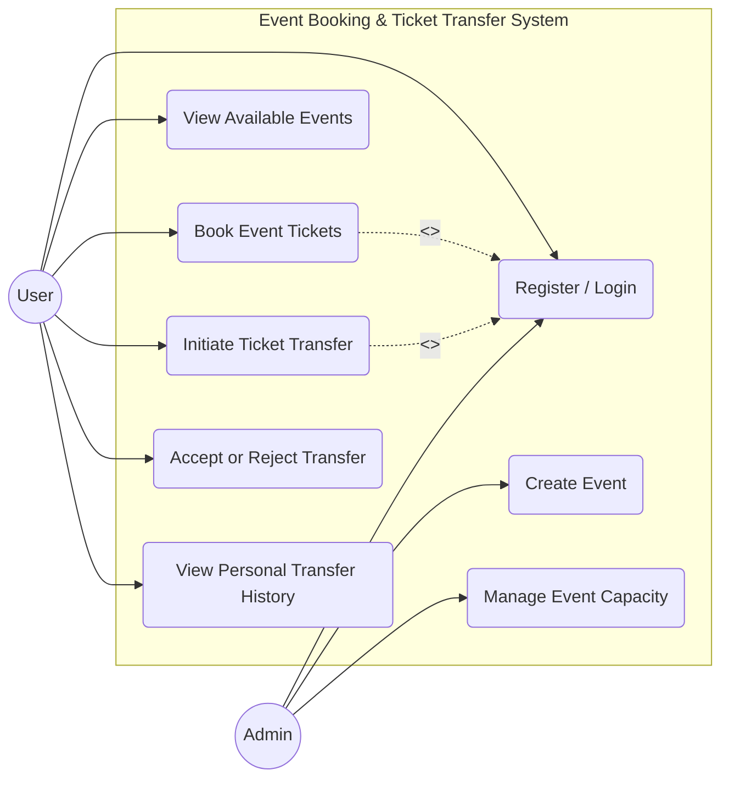

# Application Use Cases

This diagram outlines the primary interactable bounds of the system and the relationships between the platform's actors (`Admin` and `User`).

```mermaid
graph LR
    %% Actors
    Admin((Admin))
    User((User))

    %% System Boundary
    subgraph "Event Booking & Ticket Transfer System"
        direction TB
        %% Core Access
        UC1(Register / Login)
        
        %% Admin Actions
        UC2(Create Event)
        UC3(Manage Event Capacity)
        
        %% User Actions
        UC4(View Available Events)
        UC5(Book Event Tickets)
        
        %% Ticket Transfer Engine
        UC6(Initiate Ticket Transfer)
        UC7(Accept or Reject Transfer)
        UC8(View Personal Transfer History)
    end

    %% Edge Relationships
    User --> UC1
    Admin --> UC1
    
    Admin --> UC2
    Admin --> UC3
    
    User --> UC4
    User --> UC5
    User --> UC6
    User --> UC7
    User --> UC8
    
    %% Included dependencies
    UC6 -.-> |<<requires>>| UC1
    UC5 -.-> |<<requires>>| UC1
```
